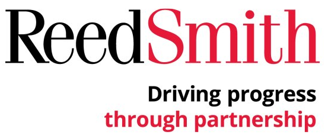

##Project Proposal

I am presenting this project to Reed Smith ("RS"), in an attempt to provide a solution for our Client Technology Services ("CTS") group to be able to quickly provide project esimates related to electronically stored information ("ESI") solutions we can provide to our client. By leveraging our analysts industry knowledge to better estimate data expansion rates, our group will be able to efficiently provide project estimates to case teams and firm clients.

>If we can develop a simple application for CTS to efficiently and accurately provide project cost estimates to case teams and clients, then we will provide a more cost conscience approach to projects, elevating the services provided and reducing write down/off of fees.

##Project Benefits

The benefits of this project include, but at not limited to the following;

1. Accurately present project estimates to client in client pitches.
2. Present clients with metrics regarding past matters, to vizualize the firm's commitment to monitoring client costs.
3. Present an accurate and quantifiable  metric for clients to consider when engaged in Early Dispute Resolution or settlement negotiation.
4. Provide clients with accurate budgets, reducing the need to write down/off billable fees and hours.
5. Increase client confidence in RS abilities to efficiently manage ESI and further developing the relationship.
6. Leverage the developed relationship to store more client data, increasing CTS department and RS revenue.

##Project Evaluation

####Project Success
The project sets out to identify key unknown expansion rates of ESI based on past processing information received from our Client Technology Operations ("CTO") department in order to provide intial cost estimates.  The projects will be determined successful, if we can develop a simple model and application for end users that can exceed the accuracy of using the average data expansion rate across processing tickets. 

####Project Risks
The risks of this project will be that it will heavily rely on CTS Analysts industry knowledge in creating the predictor assumptions in creation of the project estimates.  Since there is very little information known upfront regarding the ESI collection, we will have to rely on Analyst knowledge to estimate the level of data expansion and extraction based on their knowledge of the colletion source.  Relying on this industry knowledge, results may vary based on the accuracy of the Analysts assumptions.  In an attempt to reduce errors, we will provide a low and high estimate as well.  If we are able to adopt the application, Analyst assumptions should be added to processing ticket requests, so that we can track this information and use for future development and improvement to the model used to predict project cost.

##Steps for Presenting Findings
Name | Title | Role
---------------- | ---------------- | ----------------
Wilner, Sharri | Manager | Management
Shoemaker, Grant | Coordinator | Operations
Bratcher, Bryon | Director | Management
Hall, Dan | Client Value/Project Management | Deployment
Nelson, Jack | Director of Litigation | Management
Matter Teams | Partners | End User

##Project Schedule

Phase | Phase Start Date | Phase End Date
---------------- | ---------------- | ----------------
Inception | April 9, 2018 | April 11, 2018
Formalization | April 12, 2018 | Arpil 25, 2018
Model Development | April 26, 2018 | May 3, 2018
Deployment | May 4, 2018 | May 30, 2018
Model Management | May 30, 2018 | Present

##Background Information

In the United States, the discovery phase of commercial litigation can often be the most important phase and often can quickly become the most expensive phase of the litigation life cycle.  As companies begin to store and use larger amounts of data, or electronically stored information and new sources of ESI continue to emerge, our organization is faced with the task of trying to efficiently manage our client's ESI, as it relates to litigation.  Managing our enterprise clients' ESI for use in litigation, has become a firm business unit CTS that now competes with many of the firm's attorney based practice groups.  Outside companies that have successfully navigated this industry over the last decade have been reporting yearly revenues over 100 million dollars (2018 Owler, Relativity).

Reed Smith's CTS group has been ahead of the curve in managing our client's ESI, demonstrated by the yearly increases in department revenue over the last 5 years, when RS began down the path to fully "in-house" this service, while many AmLaw 100 Firms continued to outsource this service to third party vendors.  However, the industry is consolidating and firms are beginning to recognize this service as a large "*cash-cow*" (American Lawyer, "How a few Savvy Law Firms Turned eDiscovery into a Cash Cow", 2017).  RS must continue to rigorously enhance its client facing technology to stay competitive in this industry.

The emergence of alternative fee arrangements over the past years, which are predicted to increase over the coming years (2017 Litigation Trends Annual Survey, Norton Rose Fulbright), are largely a result of enterprise level general counsel, being dissatified with the services being performed by outside counsel.  According to the 2016 Chief Legal Officer Survey, by Altman Weil, Inc., this dissatisfaction can largely be attributed to outside counsel's ability to "*Cost Control and Efficiency*".  According to the results of the same survey, in-house general counsel's "*top efficiency initiatives are the greater use of technology tools*, *analysis of management metrics*" and "*project management training*".

The CTS department has made and continues to make significant investment in technology tools.  As a result, RS has the largest amount of active Relativity([link]( https://www.relativity.com/)) users in the world and recently deployed the industry leading analytics platform, Brainspace([link]( https://www.brainspace.com/)), to further enhance the capabilities of Relativity.

These are industry leading technologies and the CTS department does charge usage fees, to apply this technology to our clients needs, in attempt manage the collection and review of our clients' ESI in the most efficient manner possible.  However, there are a large number of uncertainties when trying to estimate the fees that can be incurred through the use of these technologies, which can dramatically affect the cost of the project.

